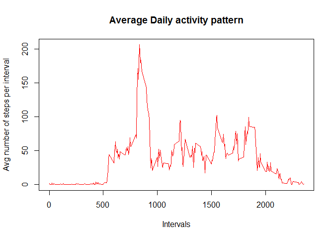
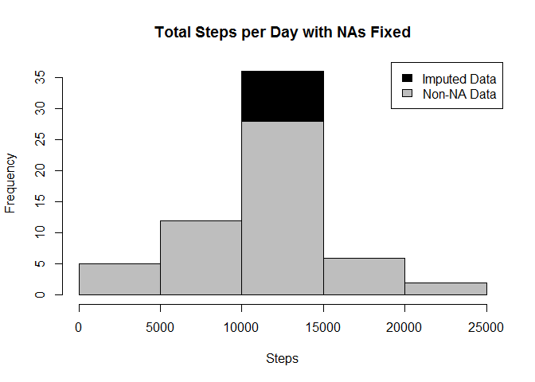
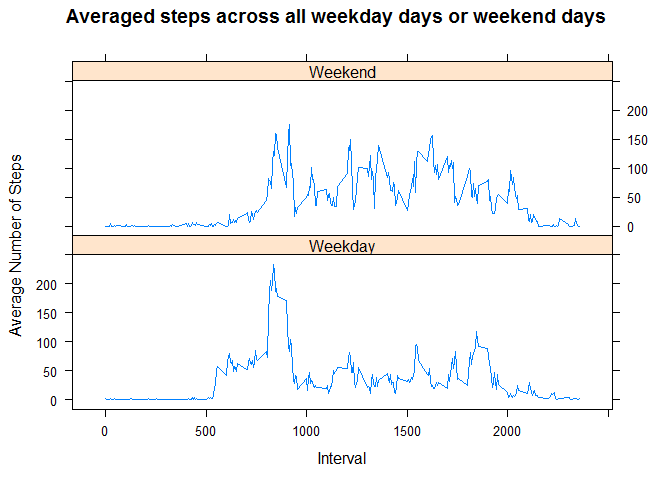

Project overview
----------------

It is now possible to collect a large amount of data about personal movement using activity monitoring devices such as a Fitbit, Nike Fuelband, or Jawbone Up. These type of devices are part of the "quantified self" movement -- a group of enthusiasts who take measurements about themselves regularly to improve their health, to find patterns in their behavior, or because they are tech geeks. But these data remain under-utilized both because the raw data are hard to obtain and there is a lack of statistical methods and software for processing and interpreting the data.

This project makes use of data from a personal activity monitoring device. This device collects data at 5 minute intervals through out the day. The data consists of two months of data from an anonymous individual collected during the months of October and November, 2012 and include the number of steps taken in 5 minute intervals each day.

``` r
library("plyr")
library("dplyr")
library("chron")
library("lattice")
library("magrittr")
```

reading files into R environment
================================

``` r
setwd("C:/users/u027332/Reproducible-Research")

if(!file.exists("activity.csv")){

datasetpath <- "https://d396qusza40orc.cloudfront.net/repdata%2Fdata%2Factivity.zip"
download.file(datasetpath, destfile="activity-test.zip")
unzip("activity-test.zip")

activity_d <- read.csv("activity.csv", header=TRUE, na.strings=c("NA","#DIV/0!",""))
}
```

Identify which columns have NAs, and idnetify Weekdays and Weekends based on date column
========================================================================================

``` r
activity_d$DateTime<- as.POSIXct(activity_d$date, format="%Y-%m-%d")
sapply(activity_d, function(x) sum(is.na(x)))
```

    ##    steps     date interval DateTime 
    ##     2304        0        0        0

``` r
activity_d$day<-weekdays(as.Date(activity_d$date))
```

Analysis without NA steps
=========================

``` r
activity_NNA<-activity_d[!is.na(activity_d$steps),]
#total number of steps each day
agg_table <- aggregate(activity_NNA$steps ~ activity_NNA$date, FUN=sum)
colnames(agg_table)<- c("Date", "Sum_day")
print("total number of steps per day:")
```

    ## [1] "total number of steps per day:"

``` r
agg_table
```

    ##          Date Sum_day
    ## 1  2012-10-02     126
    ## 2  2012-10-03   11352
    ## 3  2012-10-04   12116
    ## 4  2012-10-05   13294
    ## 5  2012-10-06   15420
    ## 6  2012-10-07   11015
    ## 7  2012-10-09   12811
    ## 8  2012-10-10    9900
    ## 9  2012-10-11   10304
    ## 10 2012-10-12   17382
    ## 11 2012-10-13   12426
    ## 12 2012-10-14   15098
    ## 13 2012-10-15   10139
    ## 14 2012-10-16   15084
    ## 15 2012-10-17   13452
    ## 16 2012-10-18   10056
    ## 17 2012-10-19   11829
    ## 18 2012-10-20   10395
    ## 19 2012-10-21    8821
    ## 20 2012-10-22   13460
    ## 21 2012-10-23    8918
    ## 22 2012-10-24    8355
    ## 23 2012-10-25    2492
    ## 24 2012-10-26    6778
    ## 25 2012-10-27   10119
    ## 26 2012-10-28   11458
    ## 27 2012-10-29    5018
    ## 28 2012-10-30    9819
    ## 29 2012-10-31   15414
    ## 30 2012-11-02   10600
    ## 31 2012-11-03   10571
    ## 32 2012-11-05   10439
    ## 33 2012-11-06    8334
    ## 34 2012-11-07   12883
    ## 35 2012-11-08    3219
    ## 36 2012-11-11   12608
    ## 37 2012-11-12   10765
    ## 38 2012-11-13    7336
    ## 39 2012-11-15      41
    ## 40 2012-11-16    5441
    ## 41 2012-11-17   14339
    ## 42 2012-11-18   15110
    ## 43 2012-11-19    8841
    ## 44 2012-11-20    4472
    ## 45 2012-11-21   12787
    ## 46 2012-11-22   20427
    ## 47 2012-11-23   21194
    ## 48 2012-11-24   14478
    ## 49 2012-11-25   11834
    ## 50 2012-11-26   11162
    ## 51 2012-11-27   13646
    ## 52 2012-11-28   10183
    ## 53 2012-11-29    7047

``` r
print("mean value of the steps:")
```

    ## [1] "mean value of the steps:"

``` r
      mean(agg_table$Sum_day)
```

    ## [1] 10766.19

``` r
print("median value of the steps:")
```

    ## [1] "median value of the steps:"

``` r
      median(agg_table$Sum_day)
```

    ## [1] 10765

``` r
hist(agg_table$Sum_day, breaks=5, xlab="Steps per day", main = "Total number of steps per day")
```


``` r
#mean of the steps by interval
agg_meanbystep <- aggregate(activity_NNA$steps ~ activity_NNA$interval, FUN=mean)
colnames(agg_meanbystep)<-c("interval","mean_interval")
agg_meanbystep$mean_interval<-round(agg_meanbystep$mean_interval,digits=2)
plot(agg_meanbystep$interval,agg_meanbystep$mean_interval, type = 'l',
     xlab="Intervals",ylab="Avg number of steps per interval", 
     col="red",main="Average Daily activity pattern")
```



``` r
agg_max<-agg_meanbystep[agg_meanbystep$mean_interval==max(agg_meanbystep$mean_interval),]
agg_max$interval
```

    ## [1] 835

Imputing missing values of the steps with mean of the same interval
===================================================================

``` r
replace_NA<-activity_d %>% 
  group_by(interval) %>% 
  mutate(steps= ifelse(is.na(steps), round(mean(steps, na.rm=TRUE),digits = 0), steps))
```

    ## Warning: package 'bindrcpp' was built under R version 3.4.4

``` r
agg_table_NA <- aggregate(replace_NA$steps ~ replace_NA$date, FUN=sum)
colnames(agg_table_NA)<- c("Date", "Sum_day")

hist(agg_table_NA$Sum_day, breaks=5, xlab="Steps", main = "Total Steps per Day with NAs Fixed", col="Black")
hist(agg_table$Sum_day, breaks=5, xlab="Steps", main = "Total Steps per Day with NAs Fixed", col="Grey", add=T)
legend("topright", c("Imputed Data", "Non-NA Data"), fill=c("black", "grey") )
```



Timeseries plot for weekday and weekend.
========================================

``` r
activity_d$DayCategory<-ifelse(activity_d$day %in% c("Saturday", "Sunday"), "Weekend", "Weekday")
agg_meanbysnd <- aggregate(activity_d$steps ~ activity_d$interval+activity_d$DayCategory, FUN=mean)

colnames(agg_meanbysnd)<- c("interval", "DayCategory","mean")

xyplot(mean~interval|DayCategory, data=agg_meanbysnd, type="l",  layout = c(1,2),
       main="Averaged steps across all weekday days or weekend days", 
       ylab="Average Number of Steps", xlab="Interval")
```


